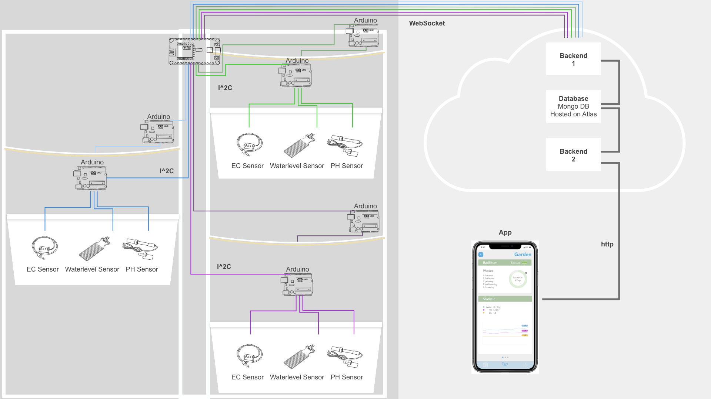

# plantarium

In unserem Projekt haben wir, innerhalb unserem Semester an der HfG Gmünd, ein automatisiertes Hydroponisches Bewässerungssysthem mit App entwickelt.
Mit diesem System kann man Pflanzen schneller großziehen und die richtigen Nährstoffe für die Pflanzen dosieren.

Der Stack besteht aus:  

der mit Vue.js umgesetzten [App](https://github.com/maxicozy/plantarium-app),  
einem [Backend](https://github.com/maxicozy/plantarium-backend-ii), dass die Daten aus der Datenbank für die App bereitstellt,   
einem [Backend](https://github.com/maxicozy/plantarium-backend-i), dass die Daten aus dem Hydroponischen System in die Datenbank einspeist  
und aus den **Nodes** die Sensordaten sammeln und die Hardware kontrollieren.  

Unser Prjektteam besteht aus:  
[Noah Mantel](https://github.com/Nodarida)  
[Ligia Dietze](https://github.com/Ligiki1)  
[Maximilian Becht](https://github.com/maxicozy)  
[Marius Schairer](https://github.com/marius220699)  

## plantarium-nodes
Unsere Sensoren und die Harware hängen zusammen wie auf der folgenden Grafik:

Die Nodes kontrollieren die Hardware und lesen mit Sensoren die Wasserwerte aus.
Sie tauschen sich über das i²C Protokoll aus, die dom-node agiert als i²C Master und die sub-nodes als Slaves

### dom-node
Der Master ist ein Esp8266, der sich die aktuelle Uhrzeit aus dem Internet holt und dementsprechend nach verschiedenen Zeitabschnitten über i²C die Daten von den Sensor-nodes, verpackt diese in einen JSON string und schickt sie über einen WebSocket an unser [backend](https://github.com/maxicozy/plantarium-backend-i).

Außerdem teilt er den led-nodes mit, dass sie nachts ausgehen und morgens die Lichter wieder anschalten sollen.

### sub-nodes
Der sub-node code läuft auf Arduino Unos.
Die sensor-nodes ermitteln ständig das Wasserlevel und die TDS und PH werte des Wassers in den Töpfen und schicken sie auf Anfrage an den Master, während die led-nodes lediglich auf Anfrage des Masters das Licht an oder aussschalten

Die Wasserlevelwerte werden nach ablauf jeder minute abgerufen da sobald dieser zu niedrig ist bald eine neue Düngermischung angefertigt werden muss, die PH und TDS werte dienen lediglich zur Überwachung ob das System zu schmutzig ist und werden daher nur jede Stunde abgefragt. Die Sensor-Node versucht zwar bei jeder request alle Daten zurückzuschicken, die ersten beiden bytes die bereitgestellt werden sind die Wasserlevel Daten und die letzten acht die beiden float-werte, unter denen ph und tds Werte gespeichert sind, da der Master abhängig von Ablauf entweder einer Stunde oder Minute entsprechend entweder alle 10 oder nur die ersten zwei bytes abfragt.
